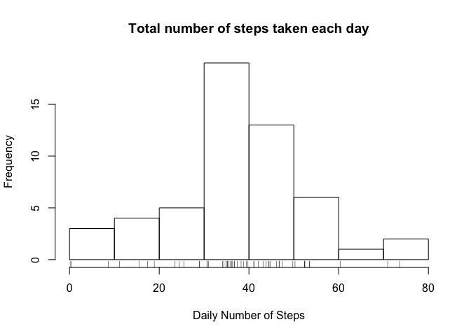
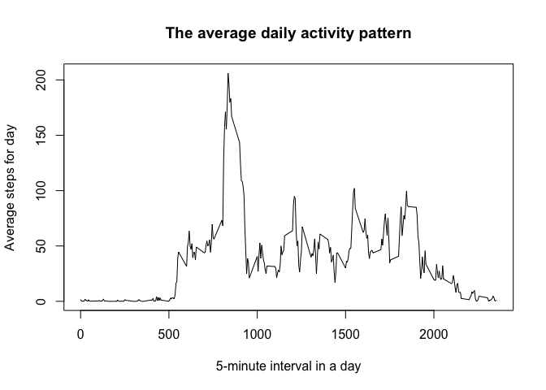
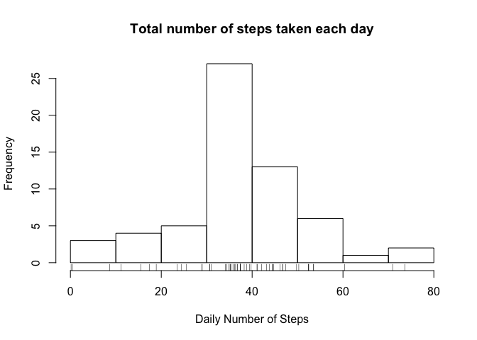
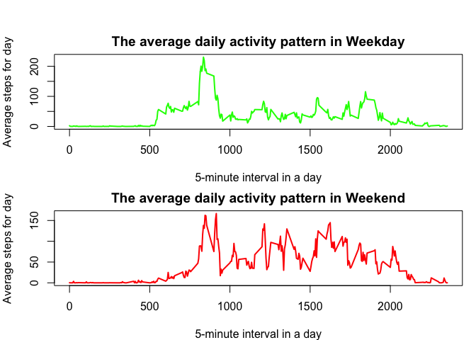

# Reproducible Research: Peer Assessment 1
by Fabio Bianchini  
18/04/2017  
## 


```
## [1] "Mar Apr 18 18 17:43:15 2017"
```

## Loading and preprocessing the data

#####1 - Load the data

```r
activity <- read_csv("~/R Workspace/RepData_PeerAssessment1/activity.csv")
```
#####2 - Process/transform the data (if necessary) into a format suitable for your analysis


```r
summary(activity)
```

```
##      steps             date               interval     
##  Min.   :  0.00   Min.   :2012-10-01   Min.   :   0.0  
##  1st Qu.:  0.00   1st Qu.:2012-10-16   1st Qu.: 588.8  
##  Median :  0.00   Median :2012-10-31   Median :1177.5  
##  Mean   : 37.38   Mean   :2012-10-31   Mean   :1177.5  
##  3rd Qu.: 12.00   3rd Qu.:2012-11-15   3rd Qu.:1766.2  
##  Max.   :806.00   Max.   :2012-11-30   Max.   :2355.0  
##  NA's   :2304
```

```r
dim(activity) 
```

```
## [1] 17568     3
```

```r
head(activity)
```

```
## # A tibble: 6 × 3
##   steps       date interval
##   <int>     <date>    <int>
## 1    NA 2012-10-01        0
## 2    NA 2012-10-01        5
## 3    NA 2012-10-01       10
## 4    NA 2012-10-01       15
## 5    NA 2012-10-01       20
## 6    NA 2012-10-01       25
```

```r
tail(activity)
```

```
## # A tibble: 6 × 3
##   steps       date interval
##   <int>     <date>    <int>
## 1    NA 2012-11-30     2330
## 2    NA 2012-11-30     2335
## 3    NA 2012-11-30     2340
## 4    NA 2012-11-30     2345
## 5    NA 2012-11-30     2350
## 6    NA 2012-11-30     2355
```

```r
str(activity)
```

```
## Classes 'tbl_df', 'tbl' and 'data.frame':	17568 obs. of  3 variables:
##  $ steps   : int  NA NA NA NA NA NA NA NA NA NA ...
##  $ date    : Date, format: "2012-10-01" "2012-10-01" ...
##  $ interval: int  0 5 10 15 20 25 30 35 40 45 ...
##  - attr(*, "spec")=List of 2
##   ..$ cols   :List of 3
##   .. ..$ steps   : list()
##   .. .. ..- attr(*, "class")= chr  "collector_integer" "collector"
##   .. ..$ date    :List of 1
##   .. .. ..$ format: chr ""
##   .. .. ..- attr(*, "class")= chr  "collector_date" "collector"
##   .. ..$ interval: list()
##   .. .. ..- attr(*, "class")= chr  "collector_integer" "collector"
##   ..$ default: list()
##   .. ..- attr(*, "class")= chr  "collector_guess" "collector"
##   ..- attr(*, "class")= chr "col_spec"
```

## What is mean total number of steps taken per day? 

#####1 - Calculate the total number of steps taken per day


```r
df1 <- group_by(activity, date)
mean.steps.4day <- summarise(df1, mean = mean(steps, na.rm = TRUE)) 
head(mean.steps.4day)
```

```
## # A tibble: 6 × 2
##         date     mean
##       <date>    <dbl>
## 1 2012-10-01      NaN
## 2 2012-10-02  0.43750
## 3 2012-10-03 39.41667
## 4 2012-10-04 42.06944
## 5 2012-10-05 46.15972
## 6 2012-10-06 53.54167
```

```r
tail(mean.steps.4day)
```

```
## # A tibble: 6 × 2
##         date     mean
##       <date>    <dbl>
## 1 2012-11-25 41.09028
## 2 2012-11-26 38.75694
## 3 2012-11-27 47.38194
## 4 2012-11-28 35.35764
## 5 2012-11-29 24.46875
## 6 2012-11-30      NaN
```

#####2 - Make a histogram of the total number of steps taken each day


```r
hist(mean.steps.4day$mean, xlab = "Daily Number of Steps", main = "Total number of steps taken each day")
rug(mean.steps.4day$mean)
```

<!-- -->

#####3 - Calculate and report the **mean** and **median** of the total number of steps taken per day


```r
df2 <- group_by(activity, date)
tot.steps.4day <- summarise(df2, sum = sum(steps, na.rm = TRUE)) # Sum calculation
head(tot.steps.4day)
```

```
## # A tibble: 6 × 2
##         date   sum
##       <date> <int>
## 1 2012-10-01     0
## 2 2012-10-02   126
## 3 2012-10-03 11352
## 4 2012-10-04 12116
## 5 2012-10-05 13294
## 6 2012-10-06 15420
```

```r
tail(tot.steps.4day)
```

```
## # A tibble: 6 × 2
##         date   sum
##       <date> <int>
## 1 2012-11-25 11834
## 2 2012-11-26 11162
## 3 2012-11-27 13646
## 4 2012-11-28 10183
## 5 2012-11-29  7047
## 6 2012-11-30     0
```

```r
mean.steps <-mean(tot.steps.4day$sum) # Mean of the total number of steps taken per day
mean.steps
```

```
## [1] 9354.23
```

*The mean is **9354**.*


```r
median.steps <- median(tot.steps.4day$sum) # Median of the total number of steps taken per day
median.steps
```

```
## [1] 10395
```

*The median is **10395**.*

## What is the average daily activity pattern? 


```r
df3 <- group_by(activity, interval)
# average number of steps taken, averaged across all days
mean.steps.4interval <- summarise(df3, mean = mean(steps, na.rm = TRUE))  
head(mean.steps.4interval)
```

```
## # A tibble: 6 × 2
##   interval      mean
##      <int>     <dbl>
## 1        0 1.7169811
## 2        5 0.3396226
## 3       10 0.1320755
## 4       15 0.1509434
## 5       20 0.0754717
## 6       25 2.0943396
```

```r
tail(mean.steps.4interval)
```

```
## # A tibble: 6 × 2
##   interval      mean
##      <int>     <dbl>
## 1     2330 2.6037736
## 2     2335 4.6981132
## 3     2340 3.3018868
## 4     2345 0.6415094
## 5     2350 0.2264151
## 6     2355 1.0754717
```
#####1 - Make a time series plot (i.e. 𝚝𝚢𝚙𝚎 = "𝚕") of the 5-minute interval (x-axis) and the average number of steps taken, averaged across all days (y-axis)

```r
plot(mean.steps.4interval$interval,mean.steps.4interval$mean, type = 'l', lwd = 1, xlab = "5-minute interval in a day", ylab = "Average steps for day", col = "black", main ="The average daily activity pattern")
```

<!-- -->

#####2 - Which 5-minute interval, on average across all the days in the dataset, contains the maximum number of steps?


```r
# 5-minute interval, on average across all the days in the dataset, contains the maximum number of steps
max.int <- filter(mean.steps.4interval, mean == max(mean.steps.4interval$mean))
max.int 
```

```
## # A tibble: 1 × 2
##   interval     mean
##      <int>    <dbl>
## 1      835 206.1698
```

*The interval with maximun number of steps is n. **835**.*

## Imputing missing values

#####1 - Calculate and report the total number of missing values in the dataset (i.e. the total number of rows with 𝙽𝙰s)


```r
num.na <- activity[is.na(activity$steps),] # Count missing value
dim(num.na)
```

```
## [1] 2304    3
```

*The are n. **2304** missing value in the original dataset.*

#####2 - Filling in all of the missing values in the dataset. 
*As a strategy for filling in all of the missing values in the dataset `activity` it will use the mean for that 5-minute interval. The dataset `mean.steps.4interval` have the necesary information for create the new dataset.*

#####3 - Create a new dataset that is equal to the original dataset but with the missing data filled in


```r
activity.new <- activity
#Get the vector of missing value
activity.na <- activity.new$interval[is.na(activity.new$steps)]
#Get corresponding location in mean.steps.4interval dataset
index <- sapply(activity.na, function(x) which(mean.steps.4interval$interval == x))
#Replace NA values with corresponding values in mean.steps.4interval
activity.new$steps[is.na(activity.new$steps)] <- mean.steps.4interval$mean[index]
```


```r
# original dataset
summary(activity)
```

```
##      steps             date               interval     
##  Min.   :  0.00   Min.   :2012-10-01   Min.   :   0.0  
##  1st Qu.:  0.00   1st Qu.:2012-10-16   1st Qu.: 588.8  
##  Median :  0.00   Median :2012-10-31   Median :1177.5  
##  Mean   : 37.38   Mean   :2012-10-31   Mean   :1177.5  
##  3rd Qu.: 12.00   3rd Qu.:2012-11-15   3rd Qu.:1766.2  
##  Max.   :806.00   Max.   :2012-11-30   Max.   :2355.0  
##  NA's   :2304
```

```r
# the new dataset
summary(activity.new)
```

```
##      steps             date               interval     
##  Min.   :  0.00   Min.   :2012-10-01   Min.   :   0.0  
##  1st Qu.:  0.00   1st Qu.:2012-10-16   1st Qu.: 588.8  
##  Median :  0.00   Median :2012-10-31   Median :1177.5  
##  Mean   : 37.38   Mean   :2012-10-31   Mean   :1177.5  
##  3rd Qu.: 27.00   3rd Qu.:2012-11-15   3rd Qu.:1766.2  
##  Max.   :806.00   Max.   :2012-11-30   Max.   :2355.0
```

#####4 - Make a histogram of the total number of steps taken each day. Calculate and report the mean and median total number of steps taken per day


```r
df4 <- group_by(activity.new, date)
mean.steps.4day2 <- summarise(df4, mean = mean(steps, na.rm = TRUE)) 
head(mean.steps.4day2)
```

```
## # A tibble: 6 × 2
##         date     mean
##       <date>    <dbl>
## 1 2012-10-01 37.38260
## 2 2012-10-02  0.43750
## 3 2012-10-03 39.41667
## 4 2012-10-04 42.06944
## 5 2012-10-05 46.15972
## 6 2012-10-06 53.54167
```

```r
tail(mean.steps.4day2)
```

```
## # A tibble: 6 × 2
##         date     mean
##       <date>    <dbl>
## 1 2012-11-25 41.09028
## 2 2012-11-26 38.75694
## 3 2012-11-27 47.38194
## 4 2012-11-28 35.35764
## 5 2012-11-29 24.46875
## 6 2012-11-30 37.38260
```

#####2 - Make a histogram of the total number of steps taken each day


```r
hist(mean.steps.4day2$mean, xlab = "Daily Number of Steps", main = "Total number of steps taken each day")
rug(mean.steps.4day2$mean)
```

<!-- -->


```r
df5 <- group_by(activity.new, date)
tot.steps.4day2 <- summarise(df5, sum = sum(steps, na.rm = TRUE)) # Sum calculation
head(tot.steps.4day2)
```

```
## # A tibble: 6 × 2
##         date      sum
##       <date>    <dbl>
## 1 2012-10-01 10766.19
## 2 2012-10-02   126.00
## 3 2012-10-03 11352.00
## 4 2012-10-04 12116.00
## 5 2012-10-05 13294.00
## 6 2012-10-06 15420.00
```

```r
tail(tot.steps.4day2)
```

```
## # A tibble: 6 × 2
##         date      sum
##       <date>    <dbl>
## 1 2012-11-25 11834.00
## 2 2012-11-26 11162.00
## 3 2012-11-27 13646.00
## 4 2012-11-28 10183.00
## 5 2012-11-29  7047.00
## 6 2012-11-30 10766.19
```

```r
mean.steps2 <-mean(tot.steps.4day2$sum) # Mean of the total number of steps taken per day
mean.steps2
```

```
## [1] 10766.19
```
*The new mean is **10766**.*

```r
median.steps2 <- median(tot.steps.4day2$sum) # Median of the total number of steps taken per day
median.steps2
```

```
## [1] 10766.19
```
*The new median is **10766**.*

#####4 - Do these values differ from the estimates from the first part of the assignment? What is the impact of imputing missing data on the estimates of the total daily number of steps?

*The new value for mean and median differ from the initial value calculated with NA value present in the original dataset. If we fiil in the missing value with the mean 5-minute interval the value for new mean and median increase.*

## Are there differences in activity patterns between weekdays and weekends? 

#####1 - Create a new factor variable in the dataset with two levels – “weekday” and “weekend” indicating whether a given date is a weekday or weekend day


```r
activity.new$week <- ifelse(weekdays(activity.new$date) == "Sabato" | weekdays(activity.new$date) == "Domenica" ,"weekend","weekday")
head(activity.new)
```

```
## # A tibble: 6 × 4
##       steps       date interval    week
##       <dbl>     <date>    <int>   <chr>
## 1 1.7169811 2012-10-01        0 weekday
## 2 0.3396226 2012-10-01        5 weekday
## 3 0.1320755 2012-10-01       10 weekday
## 4 0.1509434 2012-10-01       15 weekday
## 5 0.0754717 2012-10-01       20 weekday
## 6 2.0943396 2012-10-01       25 weekday
```

```r
table(activity.new$week)
```

```
## 
## weekday weekend 
##   12960    4608
```

#####2 - Make a panel plot containing a time series plot (i.e. 𝚝𝚢𝚙𝚎 = "𝚕") of the 5-minute interval (x-axis) and the average number of steps taken, averaged across all weekday days or weekend days (y-axis)

```r
df6 <- activity.new[activity.new$week == "weekday",]
head(df6)
```

```
## # A tibble: 6 × 4
##       steps       date interval    week
##       <dbl>     <date>    <int>   <chr>
## 1 1.7169811 2012-10-01        0 weekday
## 2 0.3396226 2012-10-01        5 weekday
## 3 0.1320755 2012-10-01       10 weekday
## 4 0.1509434 2012-10-01       15 weekday
## 5 0.0754717 2012-10-01       20 weekday
## 6 2.0943396 2012-10-01       25 weekday
```

```r
df7 <- group_by(df6, interval)
# average number of steps taken, averaged across all days in weekday
df.weekday <- summarise(df7, mean = mean(steps, na.rm = TRUE))  
```


```r
df8 <- activity.new[activity.new$week == "weekend",]
head(df8)
```

```
## # A tibble: 6 × 4
##   steps       date interval    week
##   <dbl>     <date>    <int>   <chr>
## 1     0 2012-10-06        0 weekend
## 2     0 2012-10-06        5 weekend
## 3     0 2012-10-06       10 weekend
## 4     0 2012-10-06       15 weekend
## 5     0 2012-10-06       20 weekend
## 6     0 2012-10-06       25 weekend
```

```r
df9 <- group_by(df8, interval)
# average number of steps taken, averaged across all days in weekend
df.weekend <- summarise(df9, mean = mean(steps, na.rm = TRUE))  
```

#####1 - Make a time series plot (i.e. 𝚝𝚢𝚙𝚎 = "𝚕") of the 5-minute interval (x-axis) and the average number of steps taken, averaged across all days (y-axis)

```r
par(mfrow = c(2, 1), mar = c(4, 4, 2, 1), oma = c(0, 0, 2, 0))
plot(df.weekday$interval,df.weekday$mean, type = 'l', lwd = 2, xlab = "5-minute interval in a day", ylab = "Average steps for day", col = "green", main ="The average daily activity pattern in Weekday")
plot(df.weekend$interval,df.weekend$mean, type = 'l', lwd = 2, xlab = "5-minute interval in a day", ylab = "Average steps for day", col = "red", main ="The average daily activity pattern in Weekend")
```

<!-- -->

