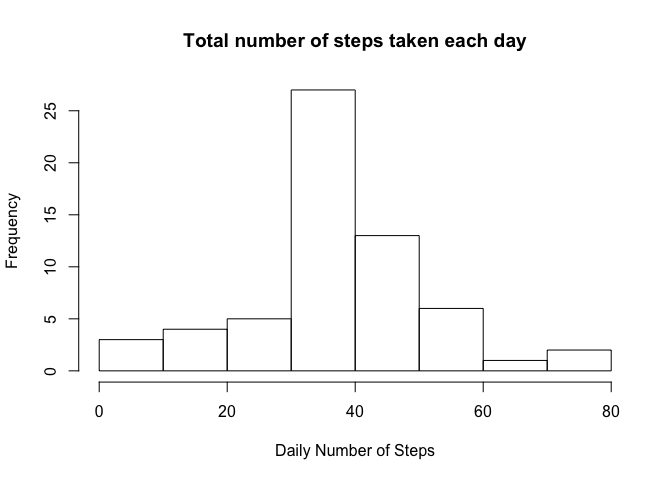
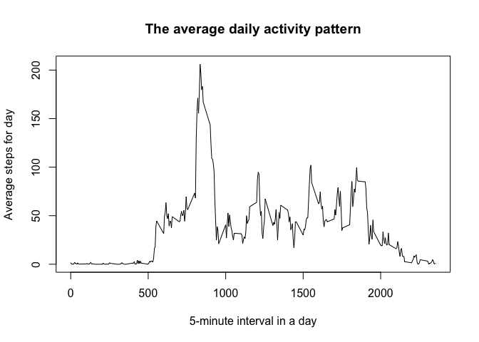

# Reproducible Research: Peer Assessment 1
## 


## Loading and preprocessing the data


```r
activity <- read_csv("~/R Workspace/RepData_PeerAssessment1/activity.csv")
```

```r
dim(activity) 
```

```
## [1] 17568     3
```

```r
head(activity)
```

```
## # A tibble: 6 × 3
##   steps       date interval
##   <int>     <date>    <int>
## 1    NA 2012-10-01        0
## 2    NA 2012-10-01        5
## 3    NA 2012-10-01       10
## 4    NA 2012-10-01       15
## 5    NA 2012-10-01       20
## 6    NA 2012-10-01       25
```

```r
str(activity)
```

```
## Classes 'tbl_df', 'tbl' and 'data.frame':	17568 obs. of  3 variables:
##  $ steps   : int  NA NA NA NA NA NA NA NA NA NA ...
##  $ date    : Date, format: "2012-10-01" "2012-10-01" ...
##  $ interval: int  0 5 10 15 20 25 30 35 40 45 ...
##  - attr(*, "spec")=List of 2
##   ..$ cols   :List of 3
##   .. ..$ steps   : list()
##   .. .. ..- attr(*, "class")= chr  "collector_integer" "collector"
##   .. ..$ date    :List of 1
##   .. .. ..$ format: chr ""
##   .. .. ..- attr(*, "class")= chr  "collector_date" "collector"
##   .. ..$ interval: list()
##   .. .. ..- attr(*, "class")= chr  "collector_integer" "collector"
##   ..$ default: list()
##   .. ..- attr(*, "class")= chr  "collector_guess" "collector"
##   ..- attr(*, "class")= chr "col_spec"
```

## What is mean total number of steps taken per day? ##

### 1 - Calculate the total number of steps taken per day

```r
y <- group_by(activity, date)
tot_steps <- summarise(y, sum(steps)) # Sum calculation
head(tot_steps)
```

```
## # A tibble: 6 × 2
##         date `sum(steps)`
##       <date>        <int>
## 1 2012-10-01           NA
## 2 2012-10-02          126
## 3 2012-10-03        11352
## 4 2012-10-04        12116
## 5 2012-10-05        13294
## 6 2012-10-06        15420
```
### 2 - Make a histogram of the total number of steps taken each day


```r
plot(tot_steps$date,tot_steps$`sum(steps)`, type = 'h', lwd = 8, xlab = "data", 
     ylab = "Steps for day", col = "gray", main ="The total number of steps taken each day")
```

<!-- -->

## 3 - Calculate and report the mean and median of the total number of steps taken per day

**a) - An histogram of the mean number of steps taken each day**


```r
z <- group_by(activity, date)
mean_steps <- summarise(z, mean(steps)) # Mean calculation
head(mean_steps)
```

```
## # A tibble: 6 × 2
##         date `mean(steps)`
##       <date>         <dbl>
## 1 2012-10-01            NA
## 2 2012-10-02       0.43750
## 3 2012-10-03      39.41667
## 4 2012-10-04      42.06944
## 5 2012-10-05      46.15972
## 6 2012-10-06      53.54167
```


```r
plot(mean_steps$date,mean_steps$`mean(steps)`, type = 'h', lwd = 8, xlab = "data", ylab = "Mean steps for day", col = "blue", main ="Steps taken (in mean) each day")
```

<!-- -->

**b) - An histogram of the median number of steps taken each day**


```r
w <- group_by(activity, date)
median_steps <- summarise(w, median(steps)) #Median calculation
head(median_steps)
```

```
## # A tibble: 6 × 2
##         date `median(steps)`
##       <date>           <dbl>
## 1 2012-10-01              NA
## 2 2012-10-02               0
## 3 2012-10-03               0
## 4 2012-10-04               0
## 5 2012-10-05               0
## 6 2012-10-06               0
```
##

```r
plot(median_steps$date,median_steps$`median(steps)`, type = 'h', lwd = 8, xlab = "data", ylab = "Median steps for day", col = "orange", main ="Steps taken (in median) each day")
```

<!-- -->

## What is the average daily activity pattern? 


```r
plot(activity$date,activity$steps, type = 'l',lwd = 1, xlab = "data", 
     ylab = "Steps for day", main ="The total number of steps taken each day")
abline(h = 10766.19, col = "red")
```

<!-- -->

## Imputing missing values

```r
num_NA <- activity[is.na(activity$steps),] # Count missin value
dim(num_NA)
```

```
## [1] 2304    3
```


```r
t <- activity[activity$steps > 0, ] # Remove zero value
```


```r
x <- activity[!is.na(activity$steps),] # Remove missin value
dim(x)
```

```
## [1] 15264     3
```
##
## Are there differences in activity patterns between weekdays and weekends? 
##
