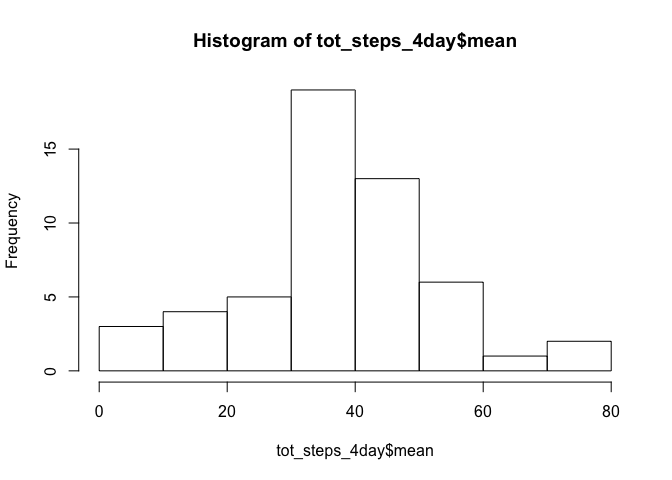
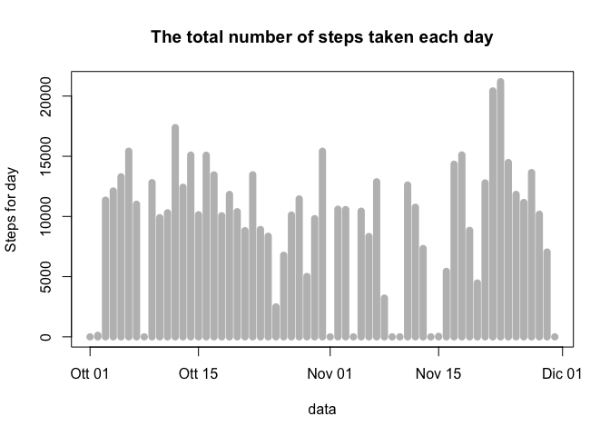

# Reproducible Research: Peer Assessment 1
## 


## Loading and preprocessing the data

#### 1) - Load the data

```r
activity <- read_csv("~/R Workspace/RepData_PeerAssessment1/activity.csv")
```
#### 2) - Process/transform the data (if necessary) into a format suitable for your analysis


```r
summary(activity)
```

```
##      steps             date               interval     
##  Min.   :  0.00   Min.   :2012-10-01   Min.   :   0.0  
##  1st Qu.:  0.00   1st Qu.:2012-10-16   1st Qu.: 588.8  
##  Median :  0.00   Median :2012-10-31   Median :1177.5  
##  Mean   : 37.38   Mean   :2012-10-31   Mean   :1177.5  
##  3rd Qu.: 12.00   3rd Qu.:2012-11-15   3rd Qu.:1766.2  
##  Max.   :806.00   Max.   :2012-11-30   Max.   :2355.0  
##  NA's   :2304
```

```r
dim(activity) 
```

```
## [1] 17568     3
```

```r
head(activity)
```

```
## # A tibble: 6 × 3
##   steps       date interval
##   <int>     <date>    <int>
## 1    NA 2012-10-01        0
## 2    NA 2012-10-01        5
## 3    NA 2012-10-01       10
## 4    NA 2012-10-01       15
## 5    NA 2012-10-01       20
## 6    NA 2012-10-01       25
```

```r
tail(activity)
```

```
## # A tibble: 6 × 3
##   steps       date interval
##   <int>     <date>    <int>
## 1    NA 2012-11-30     2330
## 2    NA 2012-11-30     2335
## 3    NA 2012-11-30     2340
## 4    NA 2012-11-30     2345
## 5    NA 2012-11-30     2350
## 6    NA 2012-11-30     2355
```

```r
str(activity)
```

```
## Classes 'tbl_df', 'tbl' and 'data.frame':	17568 obs. of  3 variables:
##  $ steps   : int  NA NA NA NA NA NA NA NA NA NA ...
##  $ date    : Date, format: "2012-10-01" "2012-10-01" ...
##  $ interval: int  0 5 10 15 20 25 30 35 40 45 ...
##  - attr(*, "spec")=List of 2
##   ..$ cols   :List of 3
##   .. ..$ steps   : list()
##   .. .. ..- attr(*, "class")= chr  "collector_integer" "collector"
##   .. ..$ date    :List of 1
##   .. .. ..$ format: chr ""
##   .. .. ..- attr(*, "class")= chr  "collector_date" "collector"
##   .. ..$ interval: list()
##   .. .. ..- attr(*, "class")= chr  "collector_integer" "collector"
##   ..$ default: list()
##   .. ..- attr(*, "class")= chr  "collector_guess" "collector"
##   ..- attr(*, "class")= chr "col_spec"
```

## What is mean total number of steps taken per day? 

#### 1) - Calculate the total number of steps taken per day

```r
y <- group_by(activity, date)
tot_steps <- summarise(y, sum = sum(steps, na.rm = TRUE)) # Sum calculation
head(tot_steps)
```

```
## # A tibble: 6 × 2
##         date   sum
##       <date> <int>
## 1 2012-10-01     0
## 2 2012-10-02   126
## 3 2012-10-03 11352
## 4 2012-10-04 12116
## 5 2012-10-05 13294
## 6 2012-10-06 15420
```

```r
tail(tot_steps)
```

```
## # A tibble: 6 × 2
##         date   sum
##       <date> <int>
## 1 2012-11-25 11834
## 2 2012-11-26 11162
## 3 2012-11-27 13646
## 4 2012-11-28 10183
## 5 2012-11-29  7047
## 6 2012-11-30     0
```


```r
mean(tot_steps$sum) # Mean of the total number of steps taken per day
```

```
## [1] 9354.23
```

```r
median(tot_steps$sum) # Median of the total number of steps taken per day
```

```
## [1] 10395
```

#### 2) - Make a histogram of the total number of steps taken each day


```r
# plot total number of steps taken per day
plot(tot_steps$date,tot_steps$sum, type = 'h', lwd = 8, xlab = "data", 
     ylab = "Steps for day", col = "gray", main ="The total number of steps taken each day")
# report the mean (red) and median (blue) of the total number of steps taken per day
abline(h= mean(tot_steps$sum), col = "red",lwd=2, lty=2)
abline(h= median(tot_steps$sum), col = "blue",lwd=2, lty=6)
# Add a legend
legend("topright", legend=c("Mean", "Median"),
       col=c("red", "blue"), lty=2:6, cex=0.8)
```

<!-- -->

## What is the average daily activity pattern? 

#### 1) - Make a time series plot of the 5-minute interval (x-axis) and the average number of steps taken, averaged across all days (y-axis)**

```r
q <- group_by(activity, interval)
p <- summarise(q, mean = mean(steps, na.rm = TRUE)) # Mean calculation
head(p)
```

```
## # A tibble: 6 × 2
##   interval      mean
##      <int>     <dbl>
## 1        0 1.7169811
## 2        5 0.3396226
## 3       10 0.1320755
## 4       15 0.1509434
## 5       20 0.0754717
## 6       25 2.0943396
```

```r
tail(p)
```

```
## # A tibble: 6 × 2
##   interval      mean
##      <int>     <dbl>
## 1     2330 2.6037736
## 2     2335 4.6981132
## 3     2340 3.3018868
## 4     2345 0.6415094
## 5     2350 0.2264151
## 6     2355 1.0754717
```


```r
plot(p$interval,p$mean, type = 'l', lwd = 1, xlab = "5-minute interval in a day", ylab = "Average steps for day", col = "black", main ="The average daily activity pattern")
```

<!-- -->

#### 2) - Which 5-minute interval, on average across all the days in the dataset, contains the maximum number of steps?


```r
max_int <- filter(p, mean == max(p$mean))
max_int
```

```
## # A tibble: 1 × 2
##   interval     mean
##      <int>    <dbl>
## 1      835 206.1698
```
*interval number 835 contains the maximum number of steps*

## Imputing missing values

#### 1) - Total number of missing values in the dataset


```r
num_NA <- activity[is.na(activity$steps),] # Count missing value
dim(num_NA)
```

```
## [1] 2304    3
```
#### 2) - Filling in all of the missing values in the dataset. 
*As a strategy for filling in all of the missing values in the dataset I will use the median for that day*

```r
df1 <- activity
df1 <- mutate(df1, steps = ifelse(is.na(steps),median(steps, na.rm = TRUE),steps)) # 
head(df1)
```

```
## # A tibble: 6 × 3
##   steps       date interval
##   <dbl>     <date>    <int>
## 1     0 2012-10-01        0
## 2     0 2012-10-01        5
## 3     0 2012-10-01       10
## 4     0 2012-10-01       15
## 5     0 2012-10-01       20
## 6     0 2012-10-01       25
```

```r
tail(df1)
```

```
## # A tibble: 6 × 3
##   steps       date interval
##   <dbl>     <date>    <int>
## 1     0 2012-11-30     2330
## 2     0 2012-11-30     2335
## 3     0 2012-11-30     2340
## 4     0 2012-11-30     2345
## 5     0 2012-11-30     2350
## 6     0 2012-11-30     2355
```
#### 4) - Make a histogram of the total number of steps taken each day. Calculate and report the mean and median total number of steps taken per day

```r
df2 <- group_by(df1, date)
df3 <- summarise(df2, sum = sum(steps, na.rm = TRUE)) # Sum calculation
head(df3)
```

```
## # A tibble: 6 × 2
##         date   sum
##       <date> <dbl>
## 1 2012-10-01     0
## 2 2012-10-02   126
## 3 2012-10-03 11352
## 4 2012-10-04 12116
## 5 2012-10-05 13294
## 6 2012-10-06 15420
```


```r
plot(df3$date,df3$sum, type = 'h', lwd = 8, xlab = "data", 
     ylab = "Steps for day", col = "gray", main ="The total number of steps taken each day")
```

<!-- -->

**report the mean and median total number of steps taken per day**

```r
df4 <- group_by(df1, date)
df5 <- summarise(df4, mean = mean(steps, na.rm = TRUE)) # Mean calculation
head(df4)
```

```
## Source: local data frame [6 x 3]
## Groups: date [1]
## 
##   steps       date interval
##   <dbl>     <date>    <int>
## 1     0 2012-10-01        0
## 2     0 2012-10-01        5
## 3     0 2012-10-01       10
## 4     0 2012-10-01       15
## 5     0 2012-10-01       20
## 6     0 2012-10-01       25
```


```r
plot(df5$date, df5$mean, type = 'h', lwd = 8, xlab = "data", 
     ylab = "Mean steps for day", col = "blue", main ="Steps taken (in mean) each day")
```

<!-- -->


```r
df6 <- group_by(df1, date)
df7 <- summarise(df6, median = median(steps, na.rm = TRUE)) # Median calculation
head(df7)
```

```
## # A tibble: 6 × 2
##         date median
##       <date>  <dbl>
## 1 2012-10-01      0
## 2 2012-10-02      0
## 3 2012-10-03      0
## 4 2012-10-04      0
## 5 2012-10-05      0
## 6 2012-10-06      0
```


```r
plot(df7$date, df7$median, type = 'h', lwd = 8, xlab = "data", 
     ylab = "Median steps for day", col = "orange", main ="Steps taken (in median) each day")
```

<!-- -->

```r
x <- activity[!is.na(activity$steps),] # Remove missing value
dim(x)
```

```
## [1] 15264     3
```

##
## Are there differences in activity patterns between weekdays and weekends? 
##
#### 1) - Create a new factor variable in the dataset with two levels – “weekday” and “weekend” indicating whether a given date is a weekday or weekend day

#### 2) - Make a panel plot containing a time series plot (i.e. 𝚝𝚢𝚙𝚎 = "𝚕") of the 5-minute interval (x-axis) and the average number of steps taken, averaged across all weekday days or weekend days (y-axis)
